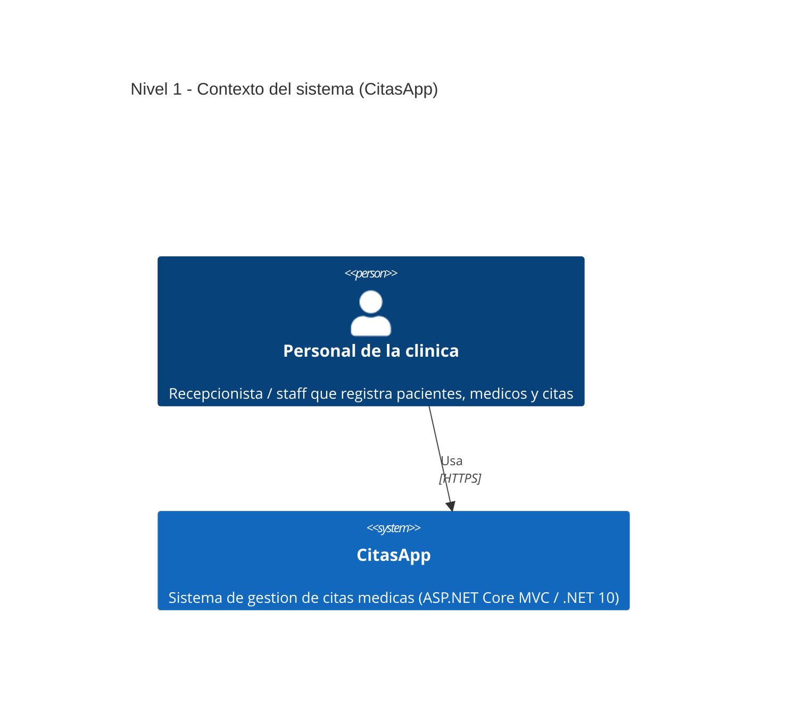
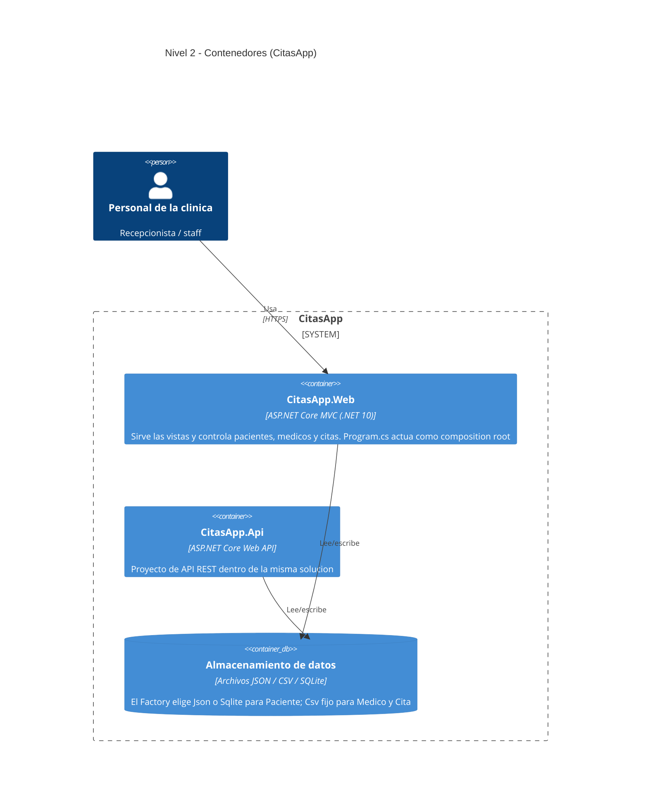
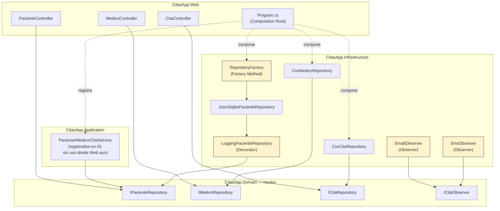

# Diagramas de arquitectura C4 — CitasApp

## Nivel 1 — Contexto del sistema

```mermaid
C4Context
    title Nivel 1 - Contexto del sistema (CitasApp)

    Person(personal, "Personal de la clinica", "Recepcionista / staff que registra pacientes, medicos y citas")

    System(citasApp, "CitasApp", "Sistema de gestion de citas medicas (ASP.NET Core MVC / .NET 10)")

    Rel(personal, citasApp, "Usa", "HTTPS")
```

## Nivel 2 — Contenedores

```mermaid
C4Container
    title Nivel 2 - Contenedores (CitasApp)

    Person(personal, "Personal de la clinica", "Recepcionista / staff")

    System_Boundary(citasApp, "CitasApp") {
        Container(web, "CitasApp.Web", "ASP.NET Core MVC (.NET 10)", "Sirve las vistas y controla pacientes, medicos y citas. Program.cs actua como composition root")
        Container(api, "CitasApp.Api", "ASP.NET Core Web API", "Proyecto de API REST dentro de la misma solucion")
        ContainerDb(datos, "Almacenamiento de datos", "Archivos JSON / CSV / SQLite", "El Factory elige Json o Sqlite para Paciente; Csv fijo para Medico y Cita")
    }

    Rel(personal, web, "Usa", "HTTPS")
    Rel(web, datos, "Lee/escribe")
    Rel(api, datos, "Lee/escribe")
```

## Nivel 3 — Componentes dentro de CitasApp

```mermaid
flowchart TB
    subgraph WEB["CitasApp.Web"]
        direction LR
        Program["Program.cs<br/>(Composition Root)"]
        CitaCtrl["CitaController"]
        PacienteCtrl["PacienteController"]
        MedicoCtrl["MedicoController"]
    end

    subgraph APP["CitasApp.Application"]
        Services["Paciente/Medico/CitaService<br/>(registrados en DI,<br/>sin uso desde Web aun)"]
    end

    subgraph DOMAIN["CitasApp.Domain — nucleo"]
        direction LR
        IPaciente["IPacienteRepository"]
        IMedico["IMedicoRepository"]
        ICita["ICitaRepository"]
        IObs["ICitaObserver"]
    end

    subgraph INFRA["CitasApp.Infrastructure"]
        direction LR
        Factory["RepositoryFactory<br/>(Factory Method)"]
        ConcretePac["Json/SqlitePacienteRepository"]
        Logging["LoggingPacienteRepository<br/>(Decorator)"]
        CsvMed["CsvMedicoRepository"]
        CsvCita["CsvCitaRepository"]
        EmailObs["EmailObserver<br/>(Observer)"]
        SmsObs["SmsObserver<br/>(Observer)"]
    end

    CitaCtrl --> ICita
    PacienteCtrl --> IPaciente
    MedicoCtrl --> IMedico
    Services --> IPaciente
    Program -.registra.-> Services

    Program -.compone.-> Factory
    Factory --> ConcretePac
    ConcretePac --> Logging
    Logging --> IPaciente

    Program -.compone.-> CsvMed
    Program -.compone.-> CsvCita
    CsvMed --> IMedico
    CsvCita --> ICita

    EmailObs --> IObs
    SmsObs --> IObs

    classDef patron fill:#fff3cd,stroke:#333;
    class Factory,Logging,EmailObs,SmsObs patron;
```
