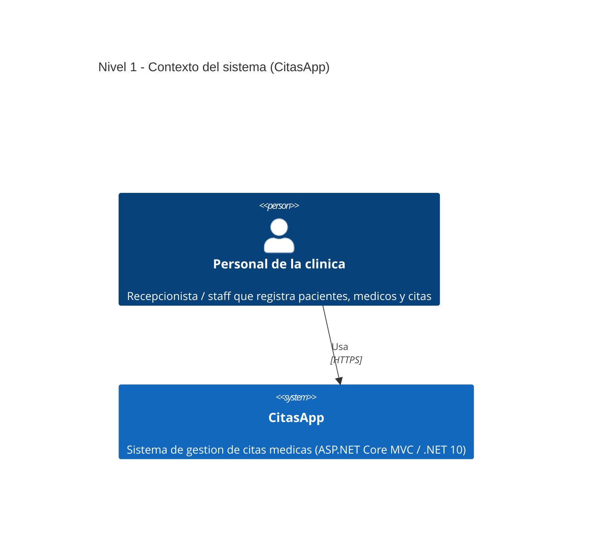
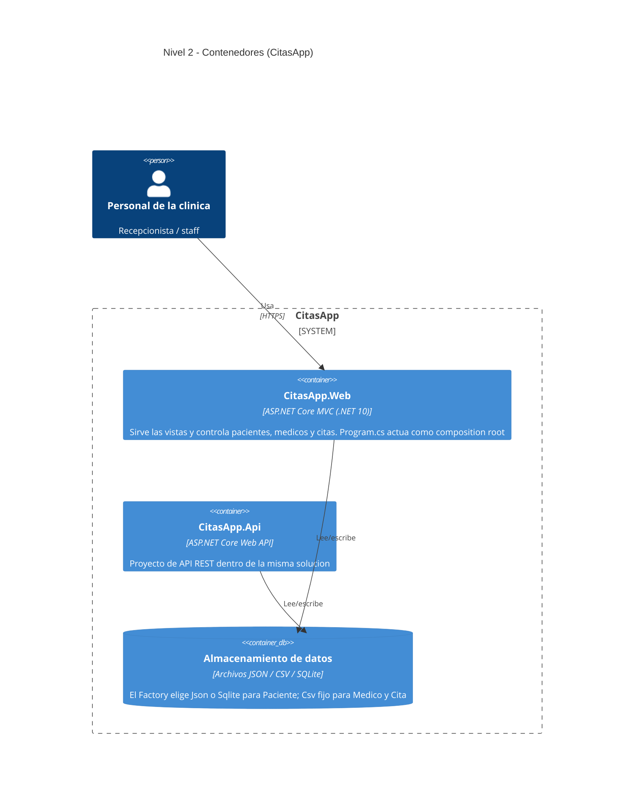
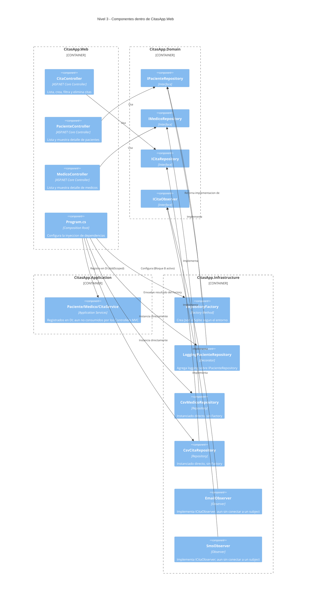

# Diagramas de arquitectura C4 — CitasApp

Estos diagramas reflejan el estado real del código de esta rama.

## Nivel 1 — Contexto del sistema

## Nivel 2 — Contenedores

## Nivel 3 — Componentes dentro de CitasApp.Web

